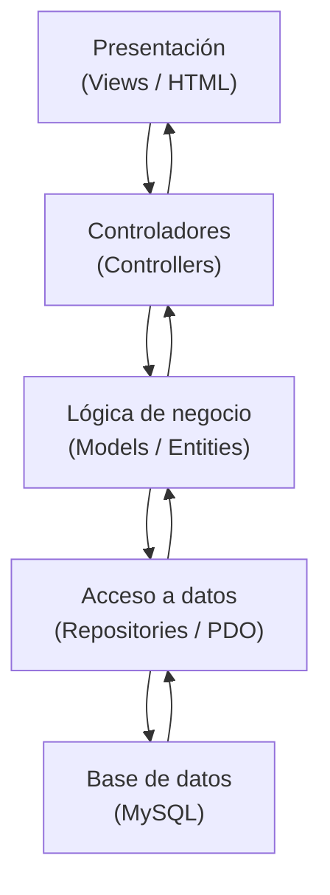

# Sistema de Gestión para Agencia de Autos

---

## Carátula

**Universidad:** Escuela DaVinci  
**Materia:** Producción Web  
**Profesor:** Calderón Nicolás Ariel  
**Alumno:** Soster Facundo Nahuel  
**Trabajo Práctico Parcial:** Sistema de Gestión para Agencia de Autos

---

## Índice

- [Sistema de Gestión para Agencia de Autos](#sistema-de-gestión-para-agencia-de-autos)
  - [Carátula](#carátula)
  - [Índice](#índice)
  - [Introducción](#introducción)
  - [Arquitectura del sistema](#arquitectura-del-sistema)
    - [Diagrama de capas](#diagrama-de-capas)
  - [Modelo de dominio](#modelo-de-dominio)
  - [Persistencia de datos](#persistencia-de-datos)
  - [Base de datos](#base-de-datos)
  - [Checklist del parcial](#checklist-del-parcial)
  - [Checklist de mejoras](#checklist-de-mejoras)
  - [Flujo de funcionamiento](#flujo-de-funcionamiento)
  - [Casos de uso](#casos-de-uso)
    - [Ingreso de un empleado](#ingreso-de-un-empleado)
    - [Alta de un vehículo por un administrador](#alta-de-un-vehículo-por-un-administrador)
  - [Funciones principales del CRUD](#funciones-principales-del-crud)
  - [Conclusión](#conclusión)

---

## Introducción

El presente proyecto consiste en el desarrollo de una aplicación web orientada a la gestión de una agencia de autos, implementada en PHP utilizando Programación Orientada a Objetos y acceso a datos mediante PDO. El sistema permite la autenticación de usuarios, la diferenciación de roles y la administración completa de vehículos mediante operaciones CRUD, manteniendo una separación clara entre lógica de negocio, acceso a datos y presentación.

El objetivo principal es aplicar conceptos fundamentales de desarrollo backend, priorizando la organización del código, la seguridad en el manejo de datos y la escalabilidad de la aplicación. A lo largo del trabajo se implementaron mecanismos de validación, control de permisos, mensajes flash, manejo de errores y una interfaz visual uniforme para que el sistema pueda ser entendido, mantenido y ampliado con facilidad.

> **Nota:** en el código las clases se llaman `User` y `Vehicle`, aunque en la consigna se mencionan como `Usuario` y `Vehiculo`. La terminología cambia, pero la intención del modelo es la misma.

---

## Arquitectura del sistema

La aplicación está estructurada siguiendo una separación de responsabilidades que divide el sistema en capas bien definidas. Los controladores reciben las solicitudes del usuario y coordinan las acciones del sistema; los repositorios gestionan la interacción con la base de datos encapsulando las consultas SQL; y las vistas se encargan de la presentación de la información al usuario. Esta organización evita la mezcla de lógica de negocio con HTML o consultas SQL, lo que facilita el mantenimiento y la evolución del sistema.

La estructura de carpetas refleja esta separación. En `App/core/` se encuentran utilidades transversales como autenticación, flash messages, logger y el controlador base. En `App/src/Models/` están las clases de dominio. En `App/src/Repositories/` se concentra la persistencia. En `App/src/Controllers/` se resuelven los flujos de cada módulo. Finalmente, en `App/src/Views/` se ubica la presentación compartida y las pantallas específicas.

Esta arquitectura permite que cada componente cumpla una sola responsabilidad. El resultado es una base de código más legible, más fácil de depurar y menos propensa a generar dependencias innecesarias entre capas.

> **Nota:** cuando una aplicación crece, esta separación evita que el proyecto termine convertido en archivos largos donde el HTML, el SQL y la lógica de negocio quedan mezclados.

### Diagrama de capas

El siguiente esquema resume el recorrido principal de la aplicación desde la interfaz hasta la base de datos.



> **Nota:** el diagrama representa el flujo principal de una petición. El usuario interactúa con la vista, el controlador coordina la acción, el modelo resuelve la lógica y el repositorio llega a la base de datos.

---

## Modelo de dominio

El diseño del sistema se basa en los principios de la Programación Orientada a la Objetos. La jerarquía de usuarios está representada por una clase base abstracta y dos especializaciones concretas: `Employee` y `Administrator`. Esa estructura permite compartir comportamiento común y, al mismo tiempo, establecer diferencias de permisos y responsabilidades según el rol.

```php
interface Authenticable {
    public function login(string $email, string $password): bool;
    public function logout(): void;
}

abstract class User implements Authenticable {
    protected ?int $id = null;
    protected string $name;
    protected string $email;
    protected ?string $password = null;
}

class Employee extends User {
    public function getRole(): string { return 'employee'; }
}

class Administrator extends User {
    public function getRole(): string { return 'admin'; }
}
```

La interface `Authenticable` funciona como contrato, ya que obliga a implementar métodos de autenticación. La clase abstracta `User`, en cambio, centraliza atributos y comportamientos compartidos. Sobre esa base se derivan los roles concretos que utiliza el sistema en sus reglas de acceso.

En el caso de los vehículos, se modela una entidad con encapsulamiento completo. La clase `Vehicle` concentra atributos como tipo, marca, modelo, año y precio, y los protege mediante getters y setters. Además, incorpora una clase abstracta auxiliar y un contador estático para reforzar los conceptos pedidos en la consigna.

```php
abstract class Manageable {
    abstract public function save(): bool;
}

class Vehicle extends Manageable {
    private ?int $id = null;
    private ?string $type = null;
    private ?string $brand = null;
    private ?string $model = null;
    private ?int $year = null;
    private ?float $price = null;

    private static int $totalInstances = 0;
}
```

> **Nota:** el uso de propiedades privadas obliga a acceder a los datos mediante métodos. Eso evita que una parte de la aplicación modifique un valor de forma directa sin pasar por validaciones.

También se aplica encapsulamiento en los setters, especialmente en campos sensibles como el precio.

```php
public function setPrice(float $price): void {
    if ($price < 0) {
        throw new InvalidArgumentException('Precio inválido');
    }
    $this->price = $price;
}
```

Este enfoque protege el objeto y evita estados incoherentes dentro del sistema.

---

## Persistencia de datos

La comunicación con la base de datos se realiza mediante PDO, lo que permite trabajar con sentencias preparadas y manejar errores de forma controlada. Esta decisión mejora la seguridad del sistema porque evita la concatenación directa de datos en consultas SQL y reduce el riesgo de inyección SQL.

El repositorio de usuarios y el repositorio de vehículos encapsulan las consultas más importantes. Por ejemplo, el login consulta por email y luego delega la validación de la contraseña al mecanismo seguro de `password_verify()`.

```php
$stmt = $pdo->prepare('SELECT * FROM users WHERE email = :email LIMIT 1');
$stmt->execute([':email' => $email]);
```

Una vez recuperado el registro, la sesión se arma únicamente si la contraseña coincide.

```php
$hashed = $user->getHashedPassword();
if ($hashed === null || !password_verify($password, $hashed)) {
    Flash::error('Credenciales incorrectas.');
    header('Location: login.php');
    exit;
}

$_SESSION['user_id'] = $user->getId();
$_SESSION['user_name'] = $user->getName();
$_SESSION['role'] = $user->getRole();
```

> **Nota:** la contraseña nunca se compara en texto plano. Primero se almacena con hash y después se valida con `password_verify()`.

Las operaciones de alta, modificación y eliminación de vehículos también se ejecutan con consultas preparadas. De este modo, los datos ingresados por formulario no se mezclan con la sentencia SQL y el acceso a datos queda controlado por una capa específica.

---

## Base de datos

El sistema utiliza una base de datos denominada `concesionario`, cuyo archivo de carga se encuentra en [App/database/concesionario.sql](database/concesionario.sql). Ese archivo contiene la estructura completa de la base junto con datos de prueba para usuarios y vehículos.

La base está compuesta principalmente por dos tablas. La tabla `users` almacena la información de los usuarios del sistema, incluyendo nombre, correo electrónico, contraseña encriptada y rol. El rol permite distinguir entre empleados y administradores, lo que impacta directamente en los permisos dentro de la aplicación. La tabla `vehicles` contiene la información de los vehículos disponibles en la agencia, con campos para tipo, marca, modelo, año, precio y fecha de creación.

```sql
CREATE TABLE `users` (
  `id` int(10) UNSIGNED NOT NULL,
  `name` varchar(100) NOT NULL,
  `email` varchar(150) NOT NULL,
  `password` varchar(255) NOT NULL,
  `role` enum('employee','admin') NOT NULL DEFAULT 'employee',
  `created_at` timestamp NOT NULL DEFAULT current_timestamp()
);
```

```sql
CREATE TABLE `vehicles` (
  `id` int(10) UNSIGNED NOT NULL,
  `type` varchar(50) DEFAULT NULL,
  `brand` varchar(100) NOT NULL,
  `model` varchar(100) NOT NULL,
  `year` smallint(5) UNSIGNED DEFAULT NULL,
  `price` decimal(10,2) NOT NULL DEFAULT 0.00,
  `created_at` timestamp NOT NULL DEFAULT current_timestamp()
);
```

Las claves primarias de ambas tablas utilizan `AUTO_INCREMENT`, lo que simplifica la inserción de registros nuevos. Además, el campo `email` en `users` se mantiene único para evitar duplicados en la autenticación.

La relación entre ambas tablas no es directa, pero el sistema utiliza la información de `users` para controlar quién puede realizar determinadas acciones sobre los vehículos. Esa decisión responde a la lógica de permisos, no a una asociación de datos entre entidades.

> **Advertencia:** si se vuelve a importar el archivo SQL sobre una base ya cargada, pueden duplicarse registros. Para pruebas limpias conviene vaciar o recrear las tablas antes de volver a ejecutar el dump.

---

## Checklist del parcial

El parcial se encuentra cubierto en sus puntos principales. La clase `Vehicle` resuelve la representación de los vehículos con propiedades privadas y métodos de acceso. La jerarquía `User` → `Employee` y `User` → `Administrator` implementa la herencia requerida. La interface `Authenticable` y la clase abstracta `Manageable` cubren la exigencia de usar al menos una abstracción formal. También se incorporaron miembros estáticos, login con sesiones, validación con `password_verify()`, CRUD de vehículos con PDO y tabla HTML para los listados.

El acceso a la gestión de usuarios está restringido exclusivamente a administradores mediante el helper `Auth::requireAdmin()`. Esa decisión evita exponer funcionalidades de administración a perfiles sin permisos. En paralelo, el sistema presenta los vehículos en una tabla HTML con acciones de edición y eliminación, lo que completa la parte visible del CRUD.

```php
Auth::requireAdmin();
```

```php
<table class="table table-striped table-hover align-middle">
```

> **Nota:** el cumplimiento no depende solo de que existan los archivos, sino de que el flujo completo funcione de manera coherente entre login, permisos, persistencia y vistas.

---

## Checklist de mejoras

El proyecto también incorpora varias mejoras que elevan la calidad del trabajo. Se definieron excepciones personalizadas por dominio, se agregaron bloques `try/catch/finally` en operaciones críticas, se centralizó el control de permisos y se unificó el sistema de mensajes mediante flash messages. Además, los errores técnicos se registran en logs y no se muestran directamente al usuario.

La aplicación también utiliza un manejador global de errores para unificar la respuesta ante fallos y dispone de un layout compartido que evita repetir encabezado, navegación y pie en todas las vistas. A eso se suma búsqueda global, ordenamiento por columnas, paginación en usuarios y vehículos, y una interfaz visual mejorada con Bootstrap.

```php
try {
    // operación crítica
} catch (ValidationException $e) {
    Flash::error($e->getMessage());
} finally {
    // punto de extensión para trazabilidad adicional
}
```

```php
set_error_handler([self::class, 'handleError']);
set_exception_handler([self::class, 'handleException']);
```

> **Nota:** estas mejoras no son solo extras; hacen que la aplicación sea más defendible, más mantenible y más cercana a un entorno real de producción.

---

## Flujo de funcionamiento

El funcionamiento del sistema comienza cuando el usuario accede al formulario de login e ingresa sus credenciales. El proceso de autenticación consulta la base de datos, recupera el usuario correspondiente y valida la contraseña de manera segura. Si el ingreso es correcto, se crea la sesión y se almacenan los datos necesarios para identificar al usuario durante la navegación.

Una vez autenticado, el usuario puede acceder a distintas funcionalidades según su rol. Los administradores tienen acceso completo, incluyendo la gestión de usuarios, mientras que los empleados cuentan con permisos más limitados. Las acciones sobre los vehículos, como creación, modificación o eliminación, pasan por un proceso de validación antes de ser persistidas en la base de datos.

El sistema mantiene el estado de navegación mediante parámetros de búsqueda, orden y paginación. Esto permite que los listados extensos puedan recorrerse sin perder el contexto de filtros aplicados ni el orden seleccionado por el usuario.

> **Nota:** conservar el estado de navegación evita que cada cambio de página obligue a rehacer la búsqueda o el ordenamiento desde cero.

---

## Casos de uso

### Ingreso de un empleado

Un empleado accede al sistema escribiendo su email y su contraseña. El formulario envía los datos al procesador de login, que verifica la existencia del usuario en la base de datos y compara la contraseña con el hash almacenado. Si la validación es correcta, la aplicación crea la sesión y redirige al panel principal.

### Alta de un vehículo por un administrador

Un administrador carga un nuevo vehículo desde el formulario correspondiente. El sistema valida que los campos obligatorios estén completos, confirma que el año y el precio sean válidos, construye el objeto `Vehicle` y lo persiste mediante el repositorio. Luego muestra un mensaje de confirmación y vuelve al listado paginado.

---

## Funciones principales del CRUD

La operación de crear recibe los datos del formulario, los valida y ejecuta un `INSERT` sobre la tabla correspondiente. La operación de lectura muestra listados, búsquedas y filtros con ordenamiento y paginación. La actualización localiza el registro por ID, valida los cambios y ejecuta un `UPDATE`. La eliminación verifica permisos y confirma la acción antes de ejecutar el `DELETE`.

En vehículos, el sistema además conserva el contexto de búsqueda, orden y página actual, de modo que una modificación o un cambio de navegación no rompa la experiencia del usuario. Esa decisión resulta importante cuando la cantidad de registros crece y el listado empieza a requerir más control visual.

```php
$page = max(1, (int)($_GET['page'] ?? 1));
$perPage = max(1, min(25, (int)($_GET['perPage'] ?? 10)));
```

> **Nota:** el CRUD no se limita a “guardar y borrar”. También implica controlar qué ve cada rol, cómo se ordenan los datos y cómo se recupera el estado entre navegaciones.

---

## Conclusión

El sistema desarrollado cumple con los requisitos planteados, integrando conceptos fundamentales de Programación Orientada a Objetos, manejo seguro de datos y organización de una aplicación web. La estructura adoptada permite que el proyecto sea mantenible y escalable, facilitando la incorporación de nuevas funcionalidades sin necesidad de reestructurar la base existente.

Este trabajo no solo demuestra la implementación técnica de los conceptos vistos en la materia, sino también la capacidad de diseñar una solución coherente, organizada y preparada para crecer. La combinación de herencia, abstracción, encapsulamiento, persistencia segura y una interfaz uniforme produce una base sólida para defender el parcial y continuar ampliando el proyecto.

> **Advertencia:** los ejemplos de código incluidos en esta documentación resumen la idea general. Para revisar la implementación completa conviene consultar el código del proyecto junto con el dump de base de datos ubicado en [App/database/concesionario.sql](database/concesionario.sql).
